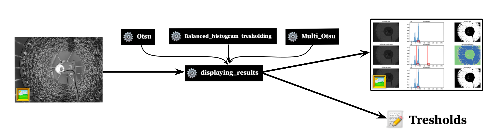
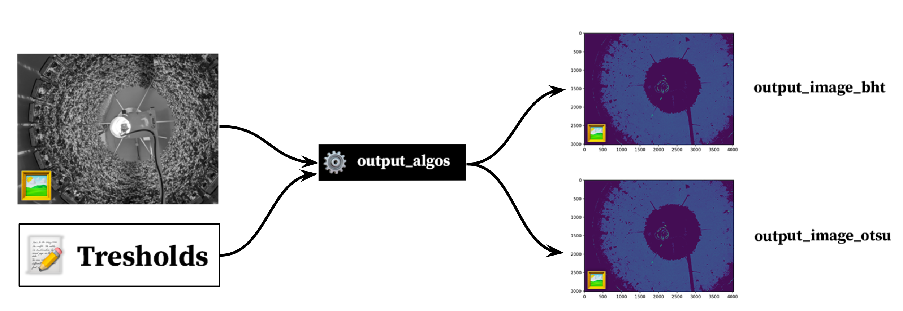
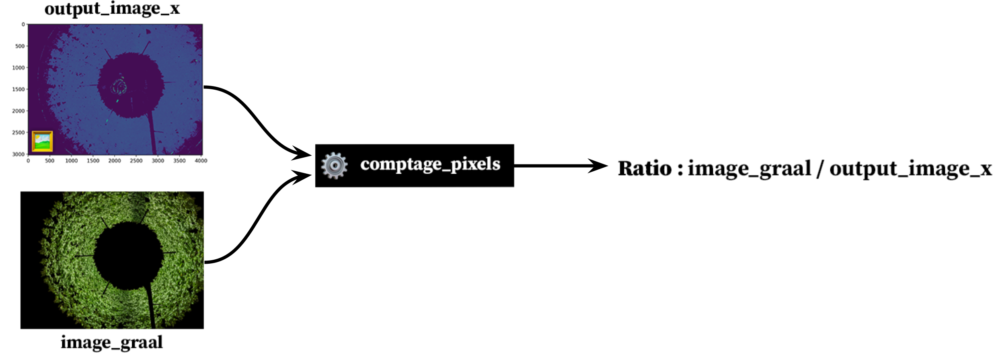
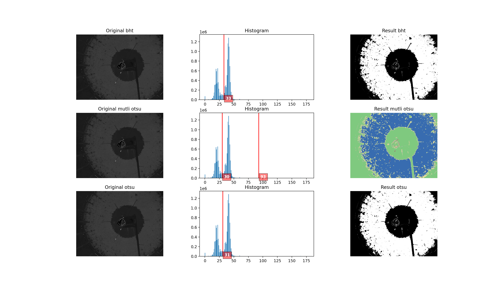
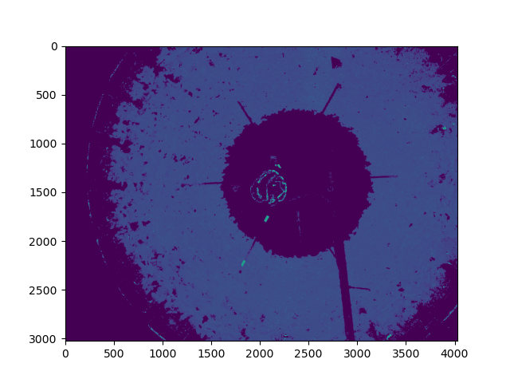

# Automatic_tresholding_FG

## I. test_bench.py

### I.1 Principe de fonctionnement

Le banc de test est là pour appliquer les algorithmes de seuillage automatique.

La première fonction que contient ce fichier est _display_results_. Cette dernière prend une image, applique respectivement l'algorithme de seuillage automatique **BHT**, **Otsu** et **MultiOtsu** puis retourne les tresholds trouvés pour ces dernières ainsi qu'une potentielle illustrant les résultats.

La seconde fonction applique les seuils trouvés pour la méthode **BHT** et **Otsu** à l'image de départ.

La dernière fonction permet de comparer les résultats du seuillage par rapport à une image de référence. Pour ce faire, elle compte le nombre de pixels non noir de l'image de référence et le divise par le nombre de pixels non noir de l'image seuillée (généralement issue de la fonction précédente).

### I.2 Fonctionnement

**I.2.1 Displaying results**

La fonction displaying_results s'utilise selon les deux arguments suivant : 
1. im : Une image en niveau de gris,
2. showR : Un booléen, vrai pour afficher les résultats à l'écran (avec MatPlotLib), Faux pour ne rien afficher.

Prenons l'exemple d'une image préalablement divisé en canaux HSV. En appliquant la fonction sur le canal *Hue* avec le paramètre *ShowR* à 0, voici ce que nous obtenons.

`displaying_results(hue, 1)`

Si l’on décide de retirer cet affichage, on obtient seulement le tableau des seuils comme indiqué dans la section sur le principe de fonctionnement.

`displaying_results(hue, 0)`

**I.2.2 output_algos**

La fonction output_algos s'utilise selon les deux arguments suivant : 
1. treshold_array : Un tableau des seuils, ceux-ci son retournés par la fonction displaying_results,
2. img : Une image en niveau de gris, généralement la même que celle mise en argument.

Cette fonction va venir appliquer un masque généré par les seuils à l'image mise en argument.

`output_algos(arr_treshs, hue)`

**I.2.3 comptage_pixels**

La fonction comptage_pixels s'utilise selon les deux arguments suivant : 
1. img_ref : Une image de référence seuilée manuellement (photo montage) qui représente le seuillage parfait,
2. img : Les images seuillées automatiques, généralement elles sont issues de la fonction output_algos.

Cette fonction va venir comparer le nombre de pixels de l'image de référence par rapport à l'image qui a été seuillée automatique par les algorithmes. Plus le résultat est proche de 1, plus ce dernier sera considéré satisfaisant, toute proportion gardée.

Résultat obtenue pour l'image obtenu précédemment : `Ratio pixels pour Otsu : 1.046019688467819`

## II. Balanced_histogram_tresholding.py

## III. Mutli_Otsu.py

## IV. Otsu.py

