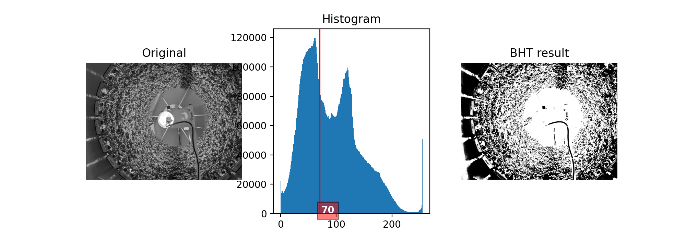
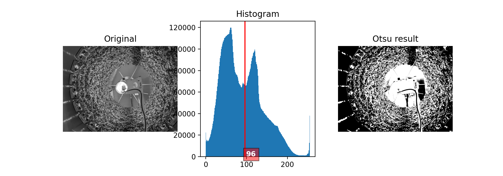
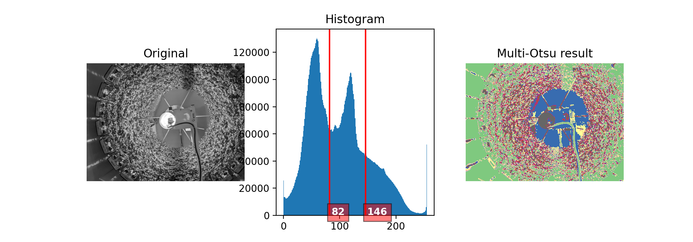

# Automatic_tresholding_FG
Codes python pour automatiser les seuils. Polytech Nantes, projet transversal pour l'entreprise Futura Gaïa. 

## ALGO : Balanced histogram tresholding

### Résulat et interprétation

Voici le résultat de l'application de l'algorithme pour l'image `J+12_PM_GA.jpg`. À gauche c'est l'image originale, au milieu l'historigramme avec le seuil calculé par la l'algorithme avec un poids initial de 50, à droite, le masque qui en résulte.

## ALGO : Otsu 

### Résulat et interprétation

Voici le résultat de l'application de l'algorithme pour l'image `J+12_PM_GA.jpg`. À gauche c'est l'image originale, au milieu l'historigramme avec le seuil calculé par la l'algorithme, à droite, le masque qui en résulte.

## ALGO : Multi Otsu 

Pour faire fonctionner l'algorithme il est important d'installer la librairie "scikit-image".

Pour ce faire, il faut ajouter la librairie à l'environnement Anaconda désiré.

1. Lancer la commande suivante dans le terminal : `conda install scikit-image`
2. Redémarrer Anaconda
3. Installer scikit-image dans votre environement

 
 
 ### Résulat et interprétation
 
Voici le résultat de l'application de l'algorithme pour l'image `J+12_PM_GA.jpg`. À gauche c'est l'image originale, au milieu l'historigramme avec les seuils calculés par la l'algorithme, à droite, le masque qui en résulte.
 

