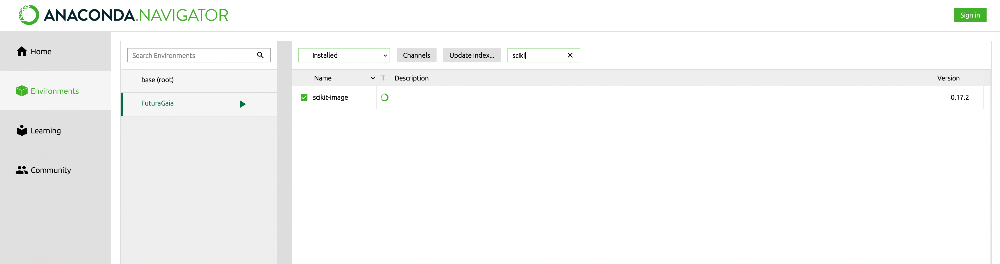

# Automatic_tresholding_FG
Codes python pour automatiser les seuils. Polytech Nantes, projet transversal pour l'entreprise Futura Gaïa. 

## ALGO : Balanced histogram tresholding

## ALGO : Otsu 

## ALGO : Multi Otsu 

Pour faire fonctionner l'algorithme il est important d'installer la librairie "scikit-image".

Pour ce faire, il faut ajouter la librairie à l'environnement Anaconda désiré.

1. Lancer la commande suivante dans le terminal : `conda install scikit-image`
2. Redémarrer Anaconda
3. Installer scikit-image dans votre environement

  
